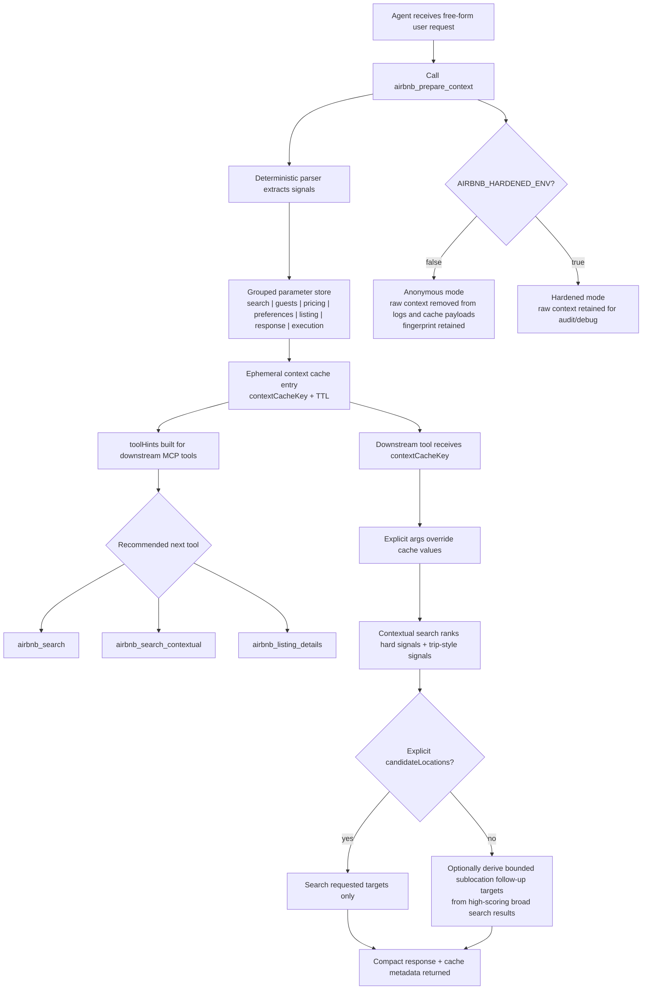

# Airbnb Search & Listings - Desktop Extension (DXT)

A comprehensive Desktop Extension for searching Airbnb listings with advanced filtering capabilities and detailed property information retrieval. Built as a Model Context Protocol (MCP) server packaged in the Desktop Extension (DXT) format for easy installation and use with compatible AI applications.

## Features

### 🔍 Advanced Search Capabilities
- **Location-based search** with support for cities, states, and regions
- **Google Maps Place ID** integration for precise location targeting
- **Date filtering** with check-in and check-out date support
- **Guest configuration** including adults, children, infants, and pets
- **Price range filtering** with minimum and maximum price constraints
- **Pagination support** for browsing through large result sets
- **Context-aware ranking** with budget, rating, and amenity prioritization
- **Context middleware** that extracts missing structured fields from free-form traveler context
- **Agent context cache** that offloads free-form user context into structured, reusable MCP parameters

### 🏠 Detailed Property Information
- **Comprehensive listing details** including amenities, policies, and highlights
- **Location information** with coordinates and neighborhood details
- **House rules and policies** for informed booking decisions
- **Property descriptions** and key features
- **Direct links** to Airbnb listings for easy booking
- **Compact-by-default responses** to reduce model context usage

### 🛡️ Security & Compliance
- **Robots.txt compliance** with configurable override for testing
- **Request timeout management** to prevent hanging requests
- **Enhanced error handling** with detailed logging
- **Rate limiting awareness** and respectful API usage
- **Secure configuration** through DXT user settings

## Installation

### For Claude Desktop
This extension is packaged as a Desktop Extension (DXT) file. To install:

1. Download the `.dxt` file from the releases page
2. Open your compatible AI application (e.g., Claude Desktop)
3. Install the extension through the application's extension manager
4. Configure the extension settings as needed

### For Cursor, etc.

Before starting make sure [Node.js](https://nodejs.org/) is installed on your desktop for `npx` to work.
1. Go to: Cursor Settings > Tools & Integrations > New MCP Server

2. Add one the following to your `mcp.json`:
    ```json
    {
      "mcpServers": {
        "airbnb": {
          "command": "npx",
          "args": [
            "-y",
            "@openbnb/mcp-server-airbnb"
          ]
        }
      }
    }
    ```

    To ignore robots.txt for all requests, use this version with `--ignore-robots-txt` args

    ```json
    {
      "mcpServers": {
        "airbnb": {
          "command": "npx",
          "args": [
            "-y",
            "@openbnb/mcp-server-airbnb",
            "--ignore-robots-txt"
          ]
        }
      }
    }
    ```
3. Restart.


### Docker

Build and run the MCP server container locally:

```bash
docker build -t airbnb-mcp-server .
docker run --rm -it airbnb-mcp-server
```

To ignore robots.txt for testing:

```bash
docker run --rm -it airbnb-mcp-server node dist/index.js --ignore-robots-txt
```

Example with context/tuning environment variables:

```bash
docker run --rm -it \
  -e AIRBNB_DEFAULT_CONTEXT_RESULTS=6 \
  -e AIRBNB_MAX_SEARCH_RESULTS=25 \
  airbnb-mcp-server
```

If you prefer Docker Compose, use the provided `docker-compose.yml`:

```bash
docker compose up --build
```

You can pass the context-related settings below via `docker run` or `docker compose`:

- `AIRBNB_DEFAULT_CONTEXT_RESULTS` (default: `6`)
- `AIRBNB_MAX_SEARCH_RESULTS` (default: `25`)
- `AIRBNB_CONTEXT_SUMMARY_LENGTH` (default: `180`)
- `AIRBNB_DETAIL_SUMMARY_LENGTH` (default: `500`)
- `AIRBNB_CONTEXT_CACHE_TTL_MS` (default: `900000`)
- `AIRBNB_HARDENED_ENV` (default: `false`)

## Configuration

The extension provides the following user-configurable options:

### Ignore robots.txt
- **Type**: Boolean (checkbox)
- **Default**: `false`
- **Description**: Bypass robots.txt restrictions when making requests to Airbnb
- **Recommendation**: Keep disabled unless needed for testing purposes

### Hardened privacy mode
- **Type**: Boolean (checkbox)
- **Default**: `false`
- **Description**: Retain original free-form context in cache entries and responses for debugging or audit workflows
- **Recommendation**: Leave disabled in non-hardened environments so context is anonymized by default

### Context cache TTL (ms)
- **Type**: String
- **Default**: `900000`
- **Description**: Lifetime of `airbnb_prepare_context` cache entries before they expire
- **Recommendation**: Keep short in shared or lower-trust environments

## Context middleware

For agent workflows, call `airbnb_prepare_context` first to convert free-form user input into an organized parameter store and an ephemeral `contextCacheKey`.

- The cache is in-memory and expires automatically.
- In non-hardened environments (`AIRBNB_HARDENED_ENV=false`), raw free-form context is not retained in cache responses or logs. The server returns `[anonymous]` plus a source fingerprint.
- In hardened environments (`AIRBNB_HARDENED_ENV=true`), the original source can be echoed back for debugging and audit flows.
- Downstream tools can consume `contextCacheKey` so agents do not need to resend the original free-form context.

The `airbnb_search_contextual` tool accepts a free-form `context` string.  
The middleware parses signals and only fills fields that were not explicitly provided.

- Parsed signals can include location, date spans, guests, budget, rating, and amenity intent.
- Explicit arguments always override context-derived values.
- `location` may be omitted in contextual search if it can be inferred from context.

Example:

```json
{
  "context": "romantic trip, checkin next Friday checkout Sunday, 2 adults and 1 child, budget under 250, must have pool and Wi-Fi, avoid noisy neighborhoods, rating at least 4.5"
}
```

Response includes:

- `context.source`: original context text in hardened mode, otherwise `[anonymous]`
- `context.sourceFingerprint`: stable fingerprint for cached/anonymized context
- `context.privacyMode`: `anonymous` or `hardened`
- `context.parsed`: extracted raw signals
- `context.usage`: which parameters were sourced from context
- `context.resolved`: final effective search parameters

The parser now extracts additional trip-fit signals such as:

- bedroom count requirements like `3 bedroom`, `3 bedrooms`, or `3br`
- bed count requirements like `3 beds`
- explicit candidate sublocations when provided through `candidateLocations` or clearly called out in free-form context
- trip-style ranking signals such as `nightlife`, `quiet`, `transit`, `remote-work`, `modern`, and `group-friendly`

## Agent cache workflow

1. Call `airbnb_prepare_context` with free-form traveler input.
2. Read the organized `store`, `signals`, and `toolHints`.
3. Call the recommended downstream tool with `contextCacheKey` or the returned `resolvedArguments`.

Example:

```json
{
  "context": "Family trip to Austin next Friday through Sunday, 2 adults and 2 kids, under $300/night, must have pool and Wi-Fi"
}
```

Response includes:

- `cache.key`: ephemeral context cache key
- `store`: grouped parameters (`search`, `guests`, `pricing`, `preferences`, `space`, `listing`, `response`, `execution`)
- `signals`: normalized parameter-path signals such as `search.location`, `search.candidateLocations`, and `preferences.tripStyles`
- `toolHints`: ready/missing state plus `cacheArguments` and `resolvedArguments` per downstream tool
- `agentGuidance`: machine-friendly readiness, repair suggestions, and workflow steps for LLM agents

For lower token usage, agents can set `agentCompact=true` on `airbnb_prepare_context` and `airbnb_search_contextual`. In compact mode, the server returns only the cache key, the minimal parsed/resolved fields, repair guidance, and the next workflow step instead of the full debug payload.

## Architecture workflow



## Search optimization

- Use `airbnb_prepare_context` first so hard constraints and trip-style signals live in cache instead of being resent as raw prose.
- Put hard filters in explicit params when possible: `requiredBedrooms`, `requiredBeds`, `maxPricePerNight`, `minRating`.
- Use `tripStyles` for deterministic ranking signals when the trip intent matters more than amenities alone.
- Keep `candidateLocations` short when you already know likely districts.
- If `candidateLocations` is omitted, `airbnb_search_contextual` can derive a bounded set of follow-up location targets from high-scoring broad search results when `AIRBNB_AUTO_EXPAND_CONTEXTUAL_LOCATIONS=true`.
- For LLM agents, prefer `agentCompact=true` so the model only sees the minimal plan and shortlisted listing fields.

## Agent-optimized flow

1. Call `airbnb_prepare_context` with `agentCompact=true`.
2. Read `recommendedTool`, `missingRequiredSignals`, `requiredRepairs`, and `nextArguments`.
3. Apply any explicit repair values the agent can determine cheaply.
4. Call `airbnb_search_contextual` with `contextCacheKey` and `agentCompact=true`.
5. Fetch `airbnb_listing_details` only for `topListingIds`.

If the agent chooses a broad `airbnb_search` first, it can still offload the original user context and resume later:

1. Call `airbnb_prepare_context` once and keep only `contextCacheKey`.
2. Call `airbnb_search` to fetch options.
3. Later, call `airbnb_reconcile_results` with `contextCacheKey` and the returned `results`.
4. Use the reconciled `recommendations` and `topListingIds` to decide which listings deserve detail fetches.

Compact responses are designed to reduce prompt bloat:

- `airbnb_prepare_context` compact mode omits `store`, `signals`, `toolHints`, and long notes.
- `airbnb_search_contextual` compact mode omits `searchUrls`, full context echo, and verbose recommendation payloads.
- Compact contextual recommendations keep only `id`, `title`, `location`, `layoutSummary`, `beds`, `bedrooms`, `rating`, `price`, `matchScore`, `matchReasons`, and `url`.

### Configurable search controls

- `AIRBNB_HARDENED_ENV`: keep raw context in cache and responses instead of anonymizing it.
- `AIRBNB_CONTEXT_CACHE_TTL_MS`: control how long prepared context survives.
- `AIRBNB_AUTO_EXPAND_CONTEXTUAL_LOCATIONS`: enable or disable bounded follow-up sublocation searches in contextual mode.
- `AIRBNB_AUTO_EXPAND_LOCATION_LIMIT`: limit how many derived sublocation targets are queried.
- `AIRBNB_AUTO_EXPAND_SCORE_THRESHOLD`: require a minimum deterministic match score before a result can seed an auto-expanded follow-up location.

## Tools

### `airbnb_prepare_context`

Normalize free-form context into a reusable parameter store for agents before running any network tool.

**Parameters:**
- `context` (optional): Free-form user request or traveler context
- Explicit overrides for downstream tool params such as `location`, `candidateLocations`, `checkin`, `checkout`, `adults`, `children`, `minPrice`, `maxPricePerNight`, `minRating`, `requiredBedrooms`, `requiredBeds`, `mustHaveAmenities`, `tripStyles`, `id`, `compact`, `maxResults`, `includeFields`, `includeSections`, `ignoreRobotsText`, and `agentCompact`

**Returns:**
- Ephemeral cache metadata including `key`, `expiresAt`, and `privacyMode`
- Organized context store grouped by usable downstream parameters
- Signal records keyed by parameter path
- `toolHints` for `airbnb_search`, `airbnb_search_contextual`, and `airbnb_listing_details`
- `toolHints` for `airbnb_search`, `airbnb_search_contextual`, `airbnb_reconcile_results`, and `airbnb_listing_details`
- `agentGuidance` with readiness, weak signals, suggested repairs, and a short workflow plan

### `airbnb_search`

Search for Airbnb listings with comprehensive filtering options.

**Parameters:**
- `location` (required): Location to search (e.g., "San Francisco, CA")
- `placeId` (optional): Google Maps Place ID (overrides location)
- `checkin` (optional): Check-in date in YYYY-MM-DD format
- `checkout` (optional): Check-out date in YYYY-MM-DD format
- `adults` (optional): Number of adults (default: 1)
- `children` (optional): Number of children (default: 0)
- `infants` (optional): Number of infants (default: 0)
- `pets` (optional): Number of pets (default: 0)
- `minPrice` (optional): Minimum price per night
- `maxPrice` (optional): Maximum price per night
- `cursor` (optional): Pagination cursor for browsing results
- `ignoreRobotsText` (optional): Override robots.txt for this request
- `contextCacheKey` (optional): Reuse structured parameters created by `airbnb_prepare_context`
- `compact` (optional, default: `true`): Return compact summaries for each listing
- `maxResults` (optional): Limit result count sent back
- `includeFields` (optional): Return only selected top-level fields in compact mode

**Returns:**
- Search results with property details, pricing, and direct links
- Pagination information for browsing additional results
- Search URL for reference

### `airbnb_listing_details`

Get detailed information about a specific Airbnb listing.

**Parameters:**
- `id` (required): Airbnb listing ID
- `checkin` (optional): Check-in date in YYYY-MM-DD format
- `checkout` (optional): Check-out date in YYYY-MM-DD format
- `adults` (optional): Number of adults (default: 1)
- `children` (optional): Number of children (default: 0)
- `infants` (optional): Number of infants (default: 0)
- `pets` (optional): Number of pets (default: 0)
- `ignoreRobotsText` (optional): Override robots.txt for this request
- `contextCacheKey` (optional): Reuse structured parameters created by `airbnb_prepare_context`
- `compact` (optional, default: `true`): Return compact sections by default
- `includeSections` (optional): Restrict sections by section ID list in compact/full response

**Returns:**
- Detailed property information including:
  - Location details with coordinates
  - Amenities and facilities
  - House rules and policies
  - Property highlights and descriptions
  - Direct link to the listing

### `airbnb_search_contextual`

Search and rank listings using traveler constraints:

**Parameters:**
- `location` (optional): Location to search (e.g., "San Francisco, CA")
- `candidateLocations` (optional): Array of narrower neighborhoods or districts to search instead of one broad location
- `checkin` (optional): Check-in date in YYYY-MM-DD format
- `checkout` (optional): Check-out date in YYYY-MM-DD format
- `adults` (optional): Number of adults (default: 1)
- `children` (optional): Number of children (default: 0)
- `infants` (optional): Number of infants (default: 0)
- `pets` (optional): Number of pets (default: 0)
- `minPrice` (optional): Minimum price per night
- `maxPrice` (optional): Maximum price per night
- `compact` (optional, default: `true`): Return compact ranking output
- `maxResults` (optional): Limit ranked recommendations
- `maxPricePerNight` (optional): Budget cap used for ranking
- `minRating` (optional): Minimum rating threshold for scoring
- `requiredBedrooms` (optional): Minimum bedroom count required
- `requiredBeds` (optional): Minimum bed count required
- `mustHaveAmenities` (optional): Amenities that should be present for stronger ranking
- `preferredAmenities` (optional): Amenities that increase ranking confidence
- `avoidAmenities` (optional): Amenities to de-prioritize candidates
- `tripStyles` (optional): Deterministic trip-intent ranking signals such as `nightlife`, `quiet`, `transit`, `remote-work`, `modern`, or `group-friendly`
- `ignoreRobotsText` (optional): Override robots.txt for this request
- `contextCacheKey` (optional): Reuse structured parameters created by `airbnb_prepare_context`
- `context` (optional): Free-form traveler context used as a fallback when fields are missing
- `agentCompact` (optional): Return a reduced response envelope for agent workflows

**Returns:**
- Ranked recommendations with `matchScore` and `matchReasons`
- Parsed context breakdown echoed back (including inferred location, dates, guests, budget, rating, space requirements, amenities, privacy mode, and which fields came from context)
- `requestedLocationTargets`, `autoExpandedLocations`, `searchedLocations`, and `searchUrls` when the server fans out one request across explicit and derived location signals
- Pagination metadata from source search query
- `agentGuidance` with the recommended next step and listing-detail fetch plan

### `airbnb_reconcile_results`

Re-score previously returned search options against cached traveler context.

This is the agent resume step: it lets the model offload user context, fetch options, drop the original prompt from working memory, and later reapply the cached trip intent to the option set.

**Parameters:**
- `contextCacheKey` (required): Reuse structured parameters created by `airbnb_prepare_context`
- `results` (required): Previously returned Airbnb search results, either compact summaries or raw search result objects
- `maxResults` (optional): Limit ranked reconciled recommendations
- `agentCompact` (optional): Return a reduced response envelope for agent workflows

**Returns:**
- Ranked `recommendations` scored against cached hard filters, amenities, and trip styles
- `topListingIds` in compact mode for the next listing-detail step
- `excluded` or `excludedCount` for options that failed hard context signals
- `agentGuidance` with the next step after reconciliation

**Notes:**
- Provide a free-form `context` string to let the server infer missing fields (location, checkin, checkout, guests, budget/rating, amenity signals, trip-style signals, and explicit sublocation lists).
- The parser is defensive and only applies inferred fields when explicit arguments are not provided.
- If both explicit values and inferred context values exist, explicit ones are used.
- For faster trip matching, prefer `airbnb_search_contextual` with explicit hard signals such as `requiredBedrooms`, `requiredBeds`, and `tripStyles`, plus a short `candidateLocations` list when you already know likely districts.

## Technical Details

### Architecture
- **Runtime**: Node.js 18+
- **Protocol**: Model Context Protocol (MCP) via stdio transport
- **Format**: Desktop Extension (DXT) v0.1
- **Dependencies**: Minimal external dependencies for security and reliability

### Error Handling
- Comprehensive error logging with timestamps
- Graceful degradation when Airbnb's page structure changes
- Timeout protection for network requests
- Detailed error messages for troubleshooting

### Security Measures
- Robots.txt compliance by default
- Request timeout limits
- Input validation and sanitization
- Secure environment variable handling
- No sensitive data storage

### Performance
- Efficient HTML parsing with Cheerio
- Request caching where appropriate
- Minimal memory footprint
- Fast startup and response times

## Compatibility

- **Platforms**: macOS, Windows, Linux
- **Node.js**: 18.0.0 or higher
- **Claude Desktop**: 0.10.0 or higher
- **Other MCP clients**: Compatible with any MCP-supporting application

## Development

### Building from Source

```bash
# Install dependencies
npm install

# Build the project
npm run build

# Watch for changes during development
npm run watch
```

### Testing

The extension can be tested by running the MCP server directly:

```bash
# Run with robots.txt compliance (default)
node dist/index.js

# Run with robots.txt ignored (for testing)
node dist/index.js --ignore-robots-txt
```

For protocol smoke tests:

```bash
# Validate the local Node build
npm run validate:protocol

# Build the container and run the same smoke tests against dockerized stdio
npm run validate:docker
```

## Legal and Ethical Considerations

- **Respect Airbnb's Terms of Service**: This extension is for legitimate research and booking assistance
- **Robots.txt Compliance**: The extension respects robots.txt by default
- **Rate Limiting**: Be mindful of request frequency to avoid overwhelming Airbnb's servers
- **Data Usage**: Only extract publicly available information for legitimate purposes

## Support

- **Issues**: Report bugs and feature requests on [GitHub Issues](https://github.com/openbnb-org/mcp-server-airbnb/issues)
- **Documentation**: Additional documentation available in the repository
- **Community**: Join discussions about MCP and DXT development

## License

MIT License - see [LICENSE](LICENSE) file for details.

## Contributing

Contributions are welcome! Please read the contributing guidelines and submit pull requests for any improvements.

---

**Note**: This extension is not affiliated with Airbnb, Inc. It is an independent tool designed to help users search and analyze publicly available Airbnb listings.
